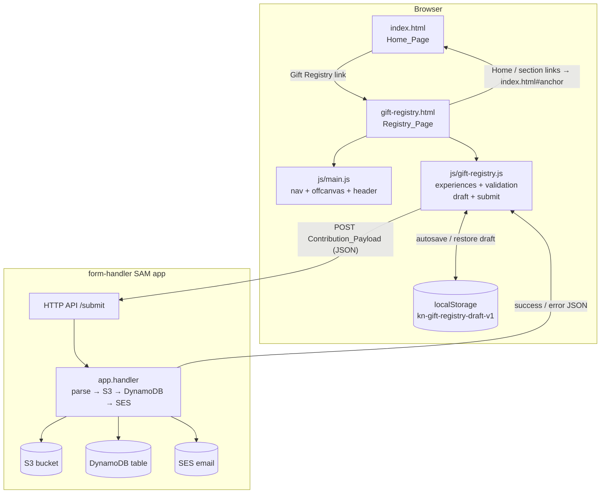

# Design Document

## Overview

This design adds a standalone gift registry page (`gift-registry.html`) to the
Kate & Neil wedding website and extends the existing `form-handler` SAM
application so it can distinguish, store, and email gift-registry contributions
alongside the existing RSVP submissions.

The registry page is a static HTML page that reuses the site's existing visual
system (Bootstrap base, `css/custom.css`, Frank Ruhl Libre + Qwitcher Grypen
fonts, cream/forest theme, glass header, chevron/curve dividers, monogram logo,
`headings-img` decorations). It presents:

1. A warm, low-pressure introduction making clear gifts are not expected.
2. A grid of honeymoon **Experiences** (image + title + description), driven by a
   simple data array so real content can be dropped in later.
3. A **Payment_Section** showing fee-free methods (PayPal link + UK bank
   transfer details) using the existing card/divider components.
4. A **Contribution_Form** that mirrors the RSVP form's interaction model
   (client-side validation, debounced localStorage draft autosave,
   submitting/success/error states) and POSTs a JSON `Contribution_Payload` to
   the existing `Submit_Endpoint`.

Because the registry page is separate from the single-page `index.html`, the
shared header navigation links that currently use in-page anchors must point
back to `index.html#anchor`, and a new "Gift Registry" link is added to both the
desktop nav and mobile offcanvas menu on `index.html` (and replicated on the new
page).

On the backend, `form-handler/src/app.py` is updated so the SES email subject and
body branch on a payload `type` field: gift-registry contributions produce a
distinct subject/body, while RSVP submissions (which carry no `type` field, or a
non-registry value) are emailed exactly as before. The handler is also corrected
to return a success response to the client after successful processing (the
current code truncates after the SES block and never returns success).

### Research Notes / Key Findings

- **Existing form module pattern** (`js/rsvp.js`): an IIFE that resolves DOM
  nodes, debounces a `saveDraft()` into `localStorage` under a versioned key
  (`kn-rsvp-draft-v1`), validates with `.is-invalid` markers on inputs and
  `.att-row.invalid` on radio groups, scrolls the error banner into view, shows
  a spinner during submit, `POST`s JSON to the endpoint, and on success replaces
  the form's inner HTML with a thank-you message. The registry form will follow
  this pattern with a distinct draft key and its own field set.
- **Header colour behaviour** (`js/main.js`): the `on-hero` body class is toggled
  by an `IntersectionObserver` watching `#home`. The registry page has no hero
  video, so `#home` will be absent and `main.js` returns early for that block —
  the header should therefore sit in its default (non-hero, dark-logo) state,
  which is exactly what the CSS does when `on-hero` is never added. No CSS change
  is required for this; the registry page simply must not include an `#home`
  hero, and should reserve top spacing equal to `--header-offset` so content is
  not hidden behind the fixed header.
- **Theme + components** (`css/custom.css`): cream/forest variables, `.standout-card`,
  `.divider`, `.section-top-curve`, `.chevron-band`, `.headings-img`, glass header
  classes, offcanvas styling, and the full RSVP form styling already exist and are
  reused verbatim. No new colour values are introduced.
- **Form-handler** (`form-handler/src/app.py`): parses JSON or urlencoded bodies,
  writes to S3, writes to DynamoDB, sends SES email with a hardcoded
  `"RSVP RECEIVED!"` subject and `json.dumps(payload, indent=2)` body, and is
  missing a trailing success `return`. SES `Source` is `rsvp@development.dtc.coty.com`,
  recipients are the couple. The fix branches subject/body on payload type and
  adds the success return.
- **Deployment**: the static site is committed/pushed to the current branch and
  served directly (GitHub Pages via `CNAME`). The form-handler requires
  `sam build` + `sam deploy` (config in `samconfig.toml`) to take effect.

## Architecture



### Component responsibilities

| Component | Responsibility |
|-----------|----------------|
| `gift-registry.html` | Page structure: header/nav, intro, experience grid, payment section, contribution form, footer. Declares the experiences data and payment config. |
| `js/main.js` (reused) | Offcanvas open/close + smooth scroll for in-page hashes; header `on-hero` toggle (no-op on registry page as `#home` is absent). |
| `js/gift-registry.js` (new) | Render experience cards from data; build selection checkboxes; validate input; autosave/restore draft; build payload; submit with submitting/success/error states. |
| `css/custom.css` (reused) | All styling. Possibly minor additive rules scoped to the registry grid only, reusing existing variables. |
| `form-handler/src/app.py` (updated) | Branch SES subject/body on payload `type`; return success response after processing. |

### Page-to-page navigation rules

- On `index.html`: desktop nav and offcanvas gain one link `Gift Registry` →
  `gift-registry.html`. Existing links keep their `#anchor` form.
- On `gift-registry.html`: the nav is replicated with identical labels/order, but
  the Home and section links point to `index.html#home`, `index.html#getting-there`,
  `index.html#accommodation`, `index.html#faqs`, the RSVP button to
  `index.html#rsvp`, and the monogram logo to `index.html#home`. The
  `Gift Registry` link points to the current page (`gift-registry.html`).
- `main.js` only smooth-scrolls offcanvas links whose `href` starts with `#` and
  whose target exists on the page; cross-page `index.html#anchor` links are left
  to the browser, so no `main.js` change is needed for cross-page nav.

## Components and Interfaces

### 1. `gift-registry.html`

Document head mirrors `index.html`: same font preconnect/stylesheet link, same
`vendor/bootstrap.min.css` and `css/custom.css`, same favicon set and
`site.webmanifest`, a non-empty `<title>` (e.g. "Gift Registry • Kate & Neil")
and non-empty `<meta name="description">`.

Body structure (top to bottom):

1. **Header** — copy of the `index.html` header markup, with link targets
   rewritten for cross-page navigation and the added `Gift Registry` link
   (marked current via `aria-current="page"`). Includes the mobile offcanvas with
   the same link set.
2. **Intro section** — `headings-img`, heading, and warm intro copy that states
   gifts are not expected and optionally invites honeymoon contributions. Placed
   above the experience grid and sized to be visible without scrolling on desktop.
3. **Experiences section** — a container with `id="experienceGrid"` into which
   cards are rendered from the experiences data. A hidden `id="experienceEmpty"`
   message element for the zero-experiences case.
4. **Payment section** — `Payment_Section` rendered with `.standout-card` +
   `.divider` showing PayPal (conditional link) and bank transfer details.
5. **Contribution form** — `id="giftForm"` following the RSVP form's structure
   and classes, including `#formError` (assertive live region) and `#formSuccess`
   (polite live region) blocks.
6. **Footer** — same footer/curve markup as `index.html`.
7. **Scripts** — `vendor/bootstrap.bundle.min.js`, `js/main.js`, and
   `js/gift-registry.js` (deferred).

### 2. `js/gift-registry.js`

To make logic testable in isolation (see Testing Strategy), the module separates
**pure functions** from DOM wiring. Pure functions are exported (e.g. attached to
`window.GiftRegistry` or exported via a module build) so they can be imported by
property-based tests.

Pure function interfaces:

```js
// Validation: returns a structured result, no DOM access.
// input: { name, email, selectedExperiences: string[], amountOrNote, message }
// returns: { valid: boolean, errors: Array<{ field, message }> }
function validateContribution(input) { /* ... */ }

// Email format check (mirrors requirement 7.3 rules)
// non-empty local part, single "@", non-empty domain with at least one "."
function isValidEmail(value) { /* ... */ }

// Build the wire payload from collected form values.
// returns Contribution_Payload (see Data Models)
function buildPayload(input) { /* ... */ }

// Draft serialization (round-trippable)
function serializeDraft(input) { /* returns JSON string with savedAt */ }
function deserializeDraft(jsonString, nowMs) {
  // returns { ok: true, draft } if parseable and within 30 days,
  // else { ok: false } (caller removes stored draft)
}
```

DOM-wiring responsibilities (impure, thin layer over the pure functions):

- **Render experiences**: iterate the experiences array; for each, create a
  card (Bootstrap column + `.standout-card` or card component) containing an
  `` (with `onerror` fallback to `images/placeholder.jpg`), the title, the
  description, and a selection control (`<input type="checkbox">` with a label
  whose value is the experience id/title). Image `alt` text includes the title.
  If the array is empty, hide the grid and show `#experienceEmpty`.
- **Autosave**: debounced (≤1s, matching RSVP's 250ms) `input`/`change` listener
  calls `serializeDraft(collect())` and writes to `localStorage` under
  `kn-gift-registry-draft-v1`, wrapped in try/catch so unavailable storage is a
  no-op.
- **Restore**: on load, read the draft, call `deserializeDraft`; if `ok`, populate
  fields and re-check selected experiences; if not `ok`, remove the stored draft.
- **Validation + messaging**: on submit, run `validateContribution`; apply
  `.is-invalid` to failing inputs and an invalid marker to the experience
  selection group; render all messages into `#formError`; scroll the top message
  into view; clear an input's invalid state on edit when it now passes.
- **Submit**: disable the submit button, show spinner, `POST`
  `buildPayload(collect())` as JSON with a 30s timeout (`AbortController`); on
  success show `#formSuccess`, clear the draft, and replace the form inner HTML
  with a thank-you message; on non-OK response or network/timeout error, show an
  error, remove the spinner, re-enable the button, and retain entered values.

### 3. `form-handler/src/app.py` (updated)

A small, pure helper is introduced so email composition is testable and the
routing rule is explicit:

```python
GIFT_REGISTRY_TYPE = "gift-registry-contribution"

def is_gift_registry(payload: dict) -> bool:
    return payload.get("type") == GIFT_REGISTRY_TYPE

def build_email(payload: dict) -> dict:
    """Return {'subject': str, 'body': str} based on payload type.
    Gift-registry contributions get a distinct subject and a formatted body
    (contributor name, email, selected experiences, amount/note, message).
    All other payloads (RSVP) keep the original subject and JSON body."""
```

- If `is_gift_registry(payload)`: subject =
  `"GIFT REGISTRY CONTRIBUTION RECEIVED!"`, body = a human-readable summary
  listing name, email, selected experiences, amount/note, and message (falling
  back to the raw JSON dump for any unexpected shape so nothing is lost).
- Otherwise: subject = `"RSVP RECEIVED!"`, body = `json.dumps(payload, indent=2)`
  — identical to current behaviour.

After the SES send succeeds, the handler returns:

```python
return {
    "statusCode": 200,
    "headers": _cors_headers(),
    "body": json.dumps({"ok": True, "id": payload["id"]}),
}
```

This success return is added for **all** payload types, fixing the existing
truncation bug without changing RSVP storage/email outcomes. Existing error
branches (S3/DynamoDB/SES failures) already return `{"ok": false, ...}` with
status 500 and are left intact.

## Data Models

### Experience (page data)

```js
// Declared in gift-registry.html or js/gift-registry.js as an array.
{
  id: string,          // stable identifier used in selection + payload
  title: string,       // 1–80 chars
  description: string, // <= 200 chars
  image: string        // path under images/, falls back to images/placeholder.jpg
}
```

The `Experience_List` is `Experience[]`. Rendering produces exactly one card per
element. An empty array triggers the "no experiences available" message.

### Payment configuration (page data)

```js
{
  paypalUrl: string | null,   // null/empty => PayPal link omitted entirely
  bank: {
    accountName: string,      // TBD placeholder until provided
    sortCode: "40-44-06",
    accountNumber: "11311093"
  }
}
```

### Contribution_Payload (wire format, JSON POST body)

```json
{
  "type": "gift-registry-contribution",
  "name": "Jane Guest",
  "email": "jane@example.com",
  "selectedExperiences": ["hot-air-balloon", "snorkel-trip"],
  "amountOrNote": "£50 towards the balloon",
  "message": "So happy for you both!"
}
```

Field rules:

| Field | Required | Constraint |
|-------|----------|------------|
| `type` | yes (always present, fixed value) | `"gift-registry-contribution"` |
| `name` | yes | 1–100 chars, non-whitespace |
| `email` | yes | 1–254 chars, valid format (7.3) |
| `selectedExperiences` | yes | array, length ≥ 1, each a known experience id |
| `amountOrNote` | no | 0–200 chars |
| `message` | no | 0–1000 chars |

The `type` field is what distinguishes contributions from RSVP submissions
(which have no `type` key). DynamoDB stores the payload as-is plus a generated
`id` (existing behaviour).

### Draft (localStorage)

```json
{
  "savedAt": 1731000000000,
  "data": {
    "name": "Jane",
    "email": "jane@",
    "selectedExperiences": ["hot-air-balloon"],
    "amountOrNote": "",
    "message": "partial..."
  }
}
```

Stored under key `kn-gift-registry-draft-v1` (distinct from the RSVP key
`kn-rsvp-draft-v1`). `savedAt` is an epoch-ms timestamp; on load, drafts older
than 30 days (or unparseable) are discarded and removed.

## Correctness Properties

*A property is a characteristic or behavior that should hold true across all valid executions of a system — essentially, a formal statement about what the system should do. Properties serve as the bridge between human-readable specifications and machine-verifiable correctness guarantees.*

These properties target this feature's **pure logic**: experience-grid
rendering, contribution-form validation, email-format checking, payload
construction, draft serialization, and the form-handler's type-routing/email
composition. They do **not** apply to the page's static markup, responsive
layout, accessibility wiring, network/timeout interaction states, or AWS service
integration — those are covered by example, edge-case, integration, and manual
tests in the Testing Strategy.

### Property 1: Experience grid renders one complete card per experience

*For any* `Experience_List` (an array of valid experiences), rendering produces
exactly one card per experience, and each card contains that experience's title,
an image element whose `alt` text includes the title, and the experience's
description; experiences whose image source is missing or empty render with the
`images/placeholder.jpg` source instead of an empty image.

**Validates: Requirements 4.1, 4.2, 4.3, 4.6**

### Property 2: Contribution validation flags exactly the failing fields and gates submission

*For any* contribution input, `validateContribution` returns `valid: true` with
an empty error set if and only if the name is non-whitespace (1–100 chars), the
email is present and well-formed, and at least one experience is selected;
otherwise the returned error set contains an entry for every field that violates
its rule and no others. When the error set is non-empty, submission is blocked
(no payload is sent) and the collected field values are unchanged; correcting any
single failing field to a valid value removes exactly that field from the error
set.

**Validates: Requirements 6.1, 6.2, 6.3, 7.1, 7.2, 7.4, 7.5, 7.6, 7.7**

### Property 3: Email format acceptance matches the specified rule

*For any* string, `isValidEmail` returns true if and only if the string has a
non-empty local part, exactly one "@" separator, and a non-empty domain part
containing at least one "." separator.

**Validates: Requirements 7.3**

### Property 4: Built payload always identifies the type and preserves all captured fields

*For any* contribution input, `buildPayload` produces an object whose `type`
equals `"gift-registry-contribution"` and whose `name`, `email`,
`selectedExperiences`, `amountOrNote`, and `message` fields equal the
corresponding captured input values.

**Validates: Requirements 8.1, 8.2, 8.3**

### Property 5: Draft serialization round-trips within the freshness window

*For any* contribution input, deserializing the result of serializing that input
(with a `savedAt` timestamp within the previous 30 days) yields draft data equal
to the original input.

**Validates: Requirements 10.1, 10.2**

### Property 6: Stale or invalid drafts are rejected

*For any* draft whose `savedAt` timestamp is older than 30 days, and *for any*
string that is not parseable as a valid draft, `deserializeDraft` returns a
not-ok result (signalling the caller to discard the stored draft and load empty
fields).

**Validates: Requirements 10.3**

### Property 7: Email routing distinguishes gift-registry from RSVP without regressing RSVP

*For any* payload, `build_email` returns the subject
`"GIFT REGISTRY CONTRIBUTION RECEIVED!"` when the payload's `type` equals
`"gift-registry-contribution"`, and returns the unchanged RSVP subject
`"RSVP RECEIVED!"` with the original `json.dumps(payload, indent=2)` body for any
payload that does not carry that type.

**Validates: Requirements 9.3, 9.4**

### Property 8: Gift-registry email body contains all contribution fields

*For any* gift-registry `Contribution_Payload`, the body produced by
`build_email` contains the contributor name, contact email, each selected
experience, the amount/note, and the message.

**Validates: Requirements 9.2**

### Property 9: Successfully processed payloads return a success response

*For any* payload, when storage and email succeed (AWS clients mocked to
succeed), the handler returns a success response (`statusCode` 200 with
`ok: true`).

**Validates: Requirements 9.5**

## Error Handling

### Front end (`js/gift-registry.js`)

- **Validation failures**: collected in a single pass; all failing fields are
  marked (`.is-invalid` on inputs, an invalid marker on the experience-selection
  group) and all messages rendered into the assertive `#formError` region, which
  is scrolled into view. Submission is aborted; entered values are retained.
- **Non-OK submit response**: read `error` from the JSON body if present, show it
  in `#formError`, remove the spinner, re-enable the submit button, retain values.
- **Network error / timeout**: an `AbortController` aborts the request after 30s;
  the `catch`/abort path shows a generic "submission failed" error and restores
  the form to its editable state with values retained.
- **In-flight guard**: a boolean (and the disabled button) prevents duplicate
  submissions while a request is pending.
- **localStorage unavailable**: all `localStorage` reads/writes are wrapped in
  try/catch; failure is a silent no-op so input and submission still work and no
  draft is saved.
- **Missing experience image**: each `` has an `onerror` handler that swaps
  the source to `images/placeholder.jpg`; missing/empty sources are set to the
  placeholder at render time.
- **Empty experience list**: the grid is hidden and the "no honeymoon experiences
  currently available" message is shown.

### Back end (`form-handler/src/app.py`)

- **Body parsing**: unchanged — supports JSON and urlencoded, falls back to `{}`.
- **S3 / DynamoDB / SES failures**: each remains wrapped in try/except returning
  `statusCode 500` with `{"ok": false, "error": <message>}` and CORS headers.
- **Success**: after SES send, return `statusCode 200` with
  `{"ok": true, "id": <payload id>}` and CORS headers (new — fixes the missing
  return). This applies uniformly to RSVP and gift-registry payloads.
- **Unexpected gift-registry shape**: `build_email` falls back to the raw JSON
  dump in the body if expected fields are absent, so no submission data is lost.

## Testing Strategy

### Dual approach

- **Property-based tests** verify the universal properties above across many
  generated inputs.
- **Unit / example tests** verify specific scenarios, conditional branches, and
  error states.
- **Integration tests** verify the form-handler's AWS wiring with mocked boto3.
- **Manual / responsive / accessibility checks** cover layout, tone, timing, and
  assistive-technology behaviour that cannot be asserted as code properties.

### Property-based testing

**Front end** — JavaScript with [fast-check](https://fast-check.dev/) on top of a
test runner (Vitest or Jest). The pure functions (`validateContribution`,
`isValidEmail`, `buildPayload`, `serializeDraft`, `deserializeDraft`, and the
grid-render function operating on a JSDOM container) are imported directly.

**Back end** — Python with [Hypothesis](https://hypothesis.readthedocs.io/) on top
of pytest, importing `build_email`, `is_gift_registry`, and `handler` (with boto3
mocked via `moto` or `unittest.mock`).

Requirements for property tests:
- Use the chosen libraries; do **not** hand-roll property testing.
- Run a **minimum of 100 iterations** per property (fast-check `numRuns: 100`,
  Hypothesis `max_examples=100`).
- Tag each test with a comment referencing its design property, in the format:
  **Feature: gift-registry, Property {number}: {property_text}**

Property-to-test mapping:

| Property | Where | Notes |
|----------|-------|-------|
| 1 Render completeness | FE (JSDOM) | Generators include missing/empty image cases (4.3). |
| 2 Validation error set + gating | FE | Generators produce valid and invalid names/emails/selections. |
| 3 Email format | FE | Generators mix valid and malformed emails. |
| 4 Payload shape | FE | Asserts fixed `type` + field preservation. |
| 5 Draft round-trip | FE | Within-30-day timestamp. |
| 6 Draft rejection | FE | Stale timestamps + arbitrary non-JSON strings. |
| 7 Email routing | BE | type present vs absent; RSVP body byte-equal to legacy. |
| 8 Email body content | BE | All fields appear in body. |
| 9 Success response | BE | Mocked AWS success; any payload → 200 ok. |

### Unit / example tests

- Page markup assertions (1.2, 1.3, 1.6, 1.8, 2.1–2.4, 3.1–3.2, 3.4, 5.1, 5.2,
  5.4, 5.5, 5.6, 6.6, 6.7, 11.1–11.4): assert presence/structure of stylesheets,
  fonts, favicons, nav links (count, labels, cross-page hrefs), intro copy,
  payment details (sort code 40-44-06, account 11311093), maxlength attributes,
  and ARIA attributes.
- Zero-experiences message (4.7).
- Submit interaction states with mocked `fetch` (8.1 single call, 8.4 in-flight
  guard, 8.5 success message, 8.6 non-OK, 8.7 network/timeout) and draft removal
  on success (10.4).
- Edge cases: optional fields empty (6.4, 6.5), localStorage throwing (10.5).

### Integration tests (form-handler)

- With mocked boto3: assert `put_object` (S3) and `put_item` (DynamoDB) are
  invoked before the response, and SES `send_email` is called (9.1, 9.2 send).
- Failure injection for S3 / DynamoDB / SES each returning 500 `ok: false` (9.6).
- **Regression guard**: an existing-shape RSVP payload still yields the
  `"RSVP RECEIVED!"` subject and JSON body and a success response (9.4, 9.5).

### Manual / responsive / accessibility checks

- Responsive: no horizontal scroll and correct column reflow at 320, 576, 992,
  1920px; single column ≤600px, multi-column >600px (1.9, 4.4, 4.5).
- Load timing under normal conditions (2.5, 2.6).
- Tone review of intro copy (3.3).
- Keyboard navigation, focus order, visible focus, and offcanvas focus return
  (11.5, 11.6); font fallback (1.4); no fee-charging payment widget (5.3).

## Deployment Considerations

Two repositories are updated and pushed directly to the current branch in each:

1. **`kateandneil.com`** (static site): add `gift-registry.html`, add
   `js/gift-registry.js`, edit `index.html` (nav links in desktop + offcanvas),
   and any additive `css/custom.css` rules. Served directly (GitHub Pages via
   `CNAME`); no build step — pushing publishes the changes.
2. **`form-handler`** (SAM app): edit `src/app.py`. Requires a redeploy to take
   effect:
   - `sam build`
   - `sam deploy` (using existing `samconfig.toml`)
   - The `Submit_Endpoint` URL is unchanged, so the front end needs no endpoint
     change.

Because the front end and back end deploy independently, sequence the rollout so
the updated `app.py` is deployed at or before the registry page goes live; until
then, contributions would still be stored and emailed but under the RSVP subject.
Both outcomes are non-destructive (no data loss), so ordering is a polish concern
rather than a correctness risk.
